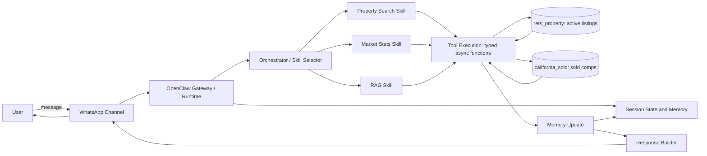

# OpenClaw Architecture: IDX Exchange MLS Agent

## Overview
OpenClaw is a multi-agent orchestration runtime handling skill routing,
session state, channel integration, and tool execution.

## Query Flow

## Components
| Component | Role in this project |
|---|---|
| Channels | WhatsApp (also email/web) |
| Sessions | Per-user conversation state |
| Skills | Property search, market stats, RAG |
| Tools | Typed async functions, e.g. SQL query runners |
| Memory | Short-term session + long-term vector storage |
| Orchestrator | Routes each query to the right skill |

## Example trace
"3 bed homes in Irvine under $1.2M" →
1. WhatsApp delivers message to Gateway
2. Orchestrator selects the Property Search skill
3. Tool runs a parameterized query on `rets_property`
   (L_City, L_Keyword2, L_SystemPrice)
4. Results go back through the response builder to WhatsApp
5. Session memory records the criteria for follow-ups

## Data layer
- `rets_property` joins `california_sold` on
  `CAST(L_ListingID AS UNSIGNED) = ListingKey`
- Market-level joins use city and postal code